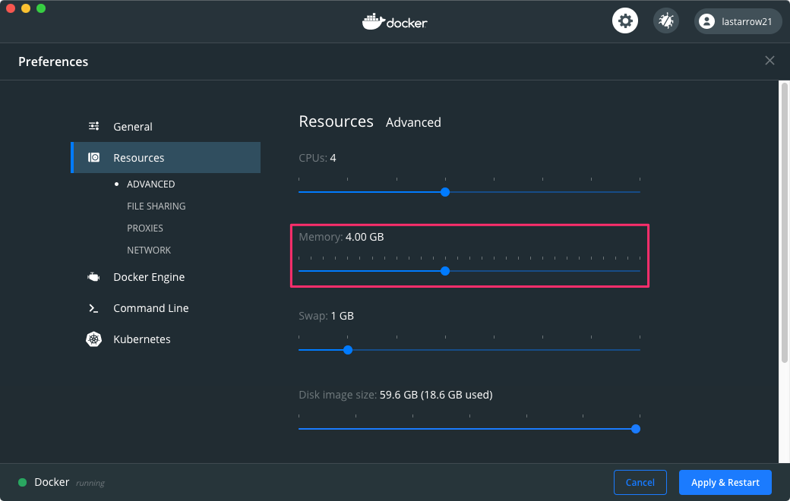

# Study Ktor 1.4 on Kotlin Native
## TOC
* Install dependencies (see [Setup](#Setup) section)
* `./gradlew build`
* `./build/bin/native/releaseExecutable/bootstrap.kexe`

## Setup
### on MacOS X
#### install curl
```shell script
brew install curl
```

### on Amazon Linux 2 on Docker
```sh
# on host
docker run --memory=4g -itd amazonlinux:latext /bin/sh
docker exec -it $(docker ps | grep 'amazonlinux' | awk '{print $1}') /bin/bash
```

#### Note.
Docker for Mac restricts memory 2GB, but compiling kotlin native takes much memory.
If compiler raises 137 error, it may occur OOME.
If it occurs, you should configure memory size.




#### install libcurl and gradle
```sh
# on container
amazon-linux-extras enable corretto8
yum clean metadata
# for gradle
yum -y install java-1.8.0-amazon-corretto-devel
# for sdkman
yum -y install which zip unzip
# for kotlin/native
yum -y install tar gcc gcc-c++ make ncurses-compat-libs
# for ktor curl client
yum -y install libcurl-devel openssl-devel
curl -s http://get.sdkman.io | bash
sh /root/.sdkman/bin/sdkman-init.sh
source /root/.bashrc
sdk install gradle
```

* [Install Gradle on Amazon Linux][install gradle on amazon linux]

[install gradle on amazon linux]: https://hacknote.jp/archives/16618/

